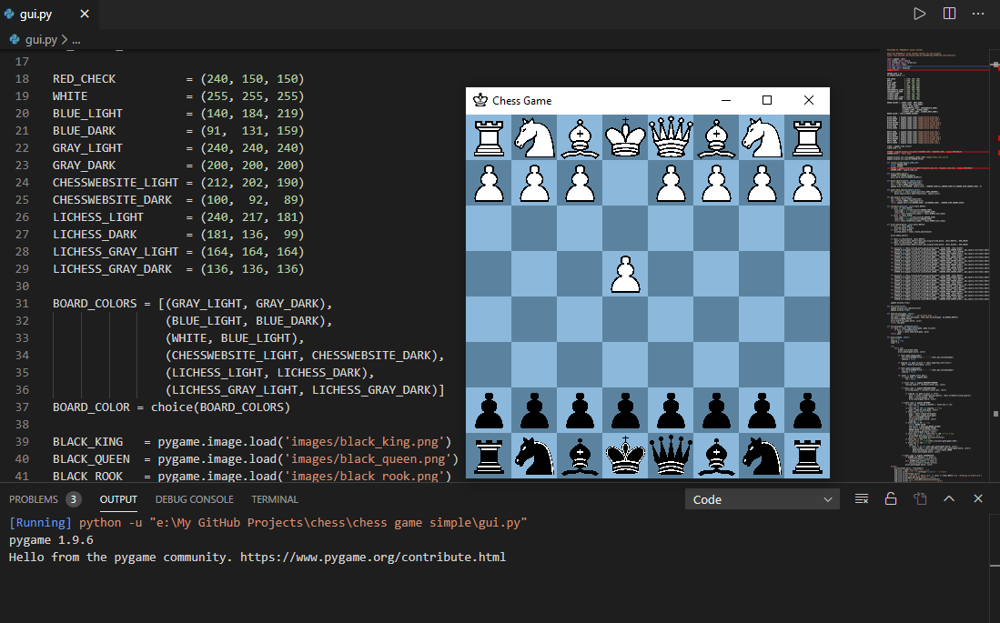

# Created-Chess-Game-Using-Tkinter

CHESS GAME IN PYTHON

Developed By Muhammad Arslan

GUI of the Chess Game

*** Contact me on Facebook ***

https://www.facebook.com/mrarslanusuf

Like My Facebook Page:https://www.facebook.com/mrarslan07

E-mail: Arslanusuf@hotmail.com

***** IF YOU FIND ANY ERRORS OR ANY PROBLEMS RELATED THIS PROGRAM, FEEL FREE TO CONTACT US *****  

***** GIVE A STAR IF YOU LOVED MY WORK *****

#THANK YOU FOR DOWNLOADING
